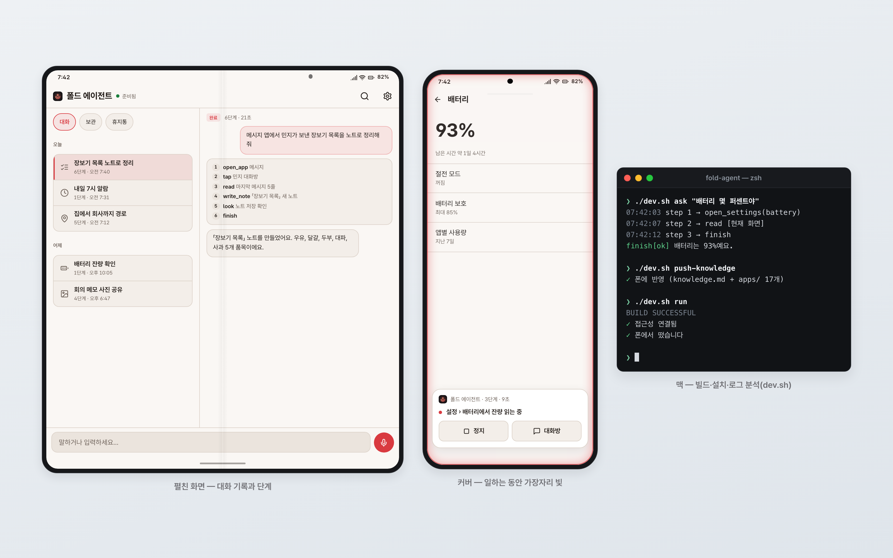
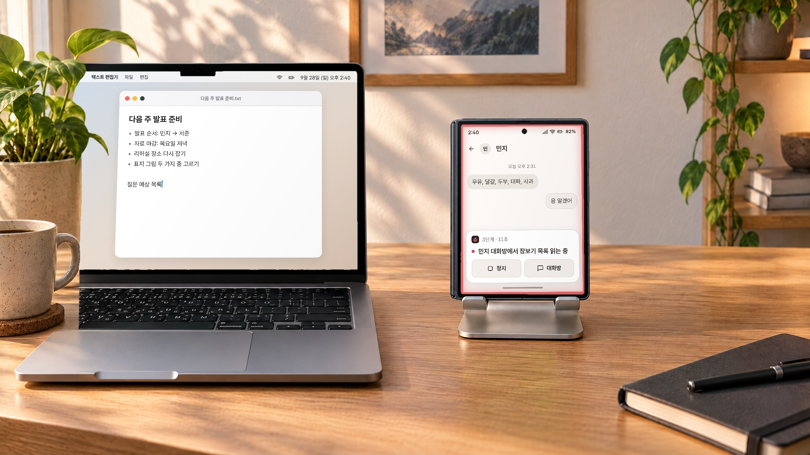
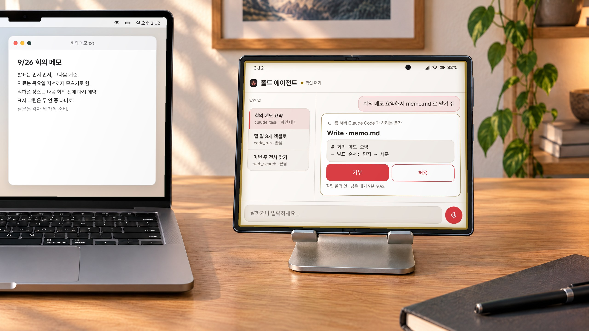
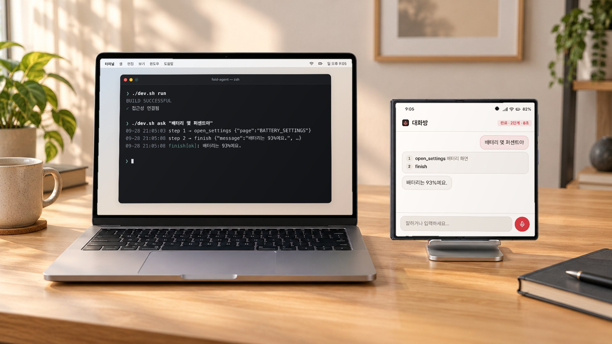
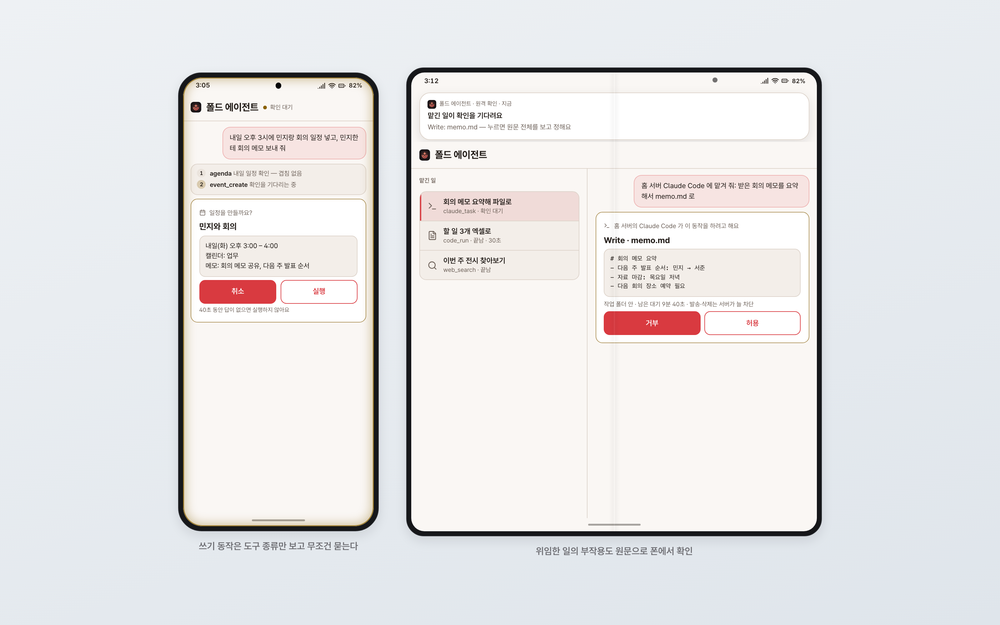
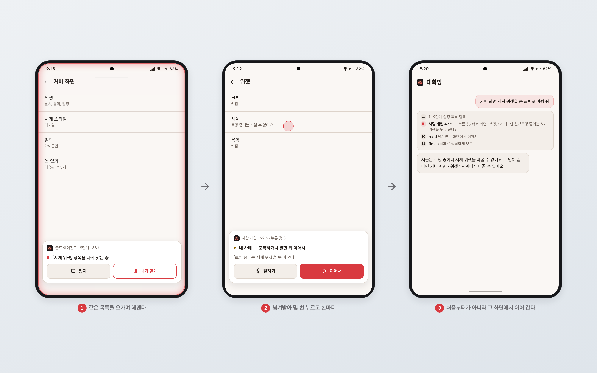
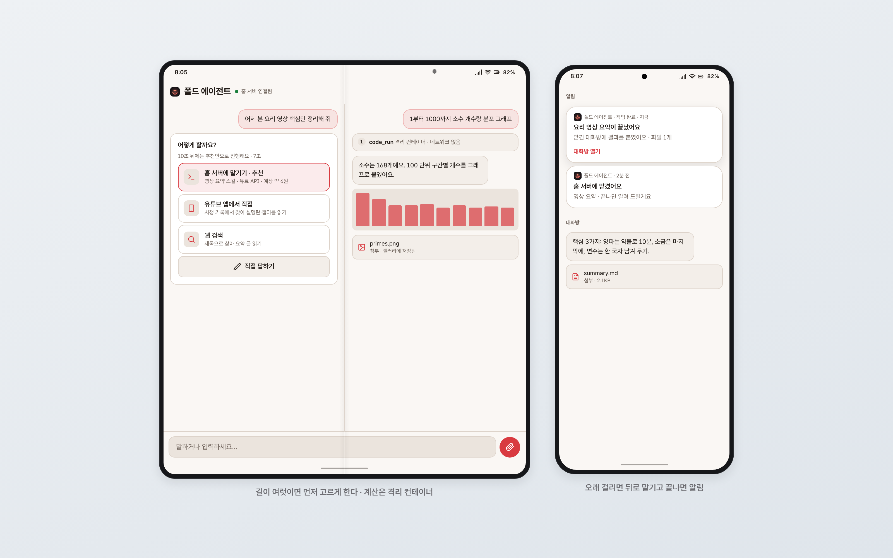
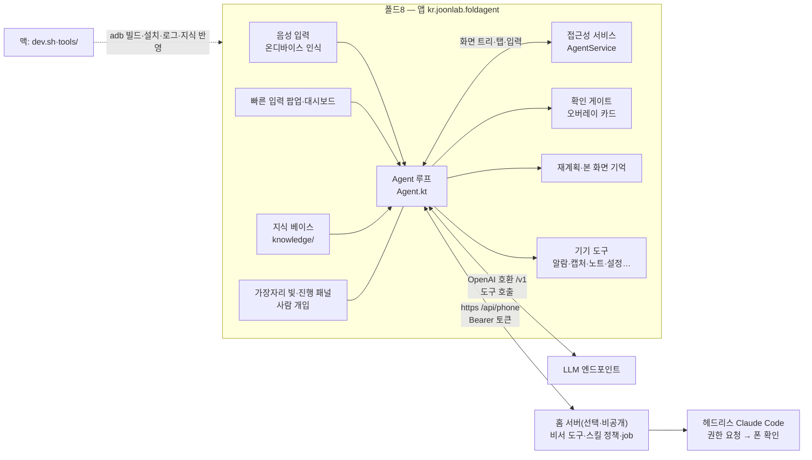
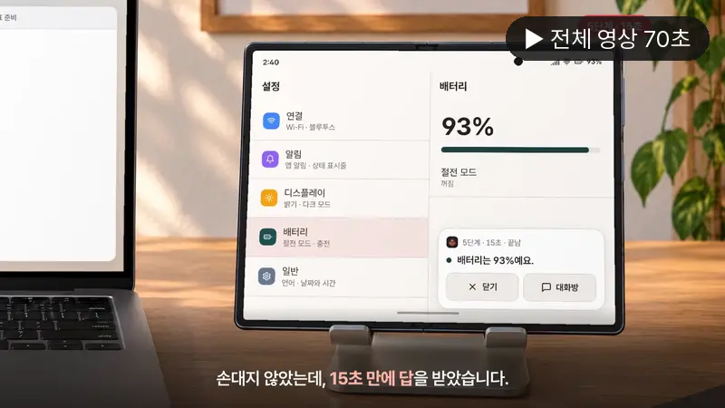

# 폴드 에이전트 (fold-agent)

말로 시키면 폰이 스스로 앱을 열고, 누르고, 결과를 말해 주는 안드로이드 에이전트 앱.

> **English** — fold-agent is a Claude Code–style agent that runs on the phone: an accessibility service reads the screen, on-device speech recognition takes the request, and an LLM tool loop taps, types and scrolls until the job is done.
> Every irreversible action goes through a confirm gate decided by code, not by the model; when the agent gets stuck it re-plans, and a human can take over mid-run and hand back.
> Optional home-server tools add calendar/mail/memory, a policy-gated skill runner, and delegation to a headless Claude Code — with each side effect confirmed on the phone.

동작 확인: Galaxy Z Fold8 (Android 17) · macOS 26


화면은 설명용 목업입니다.

## 왜 만들었나

저는 10년 가까이 아이폰을 쓰다가 Galaxy Z Fold8 로 옮겼습니다. 맥과 폰 사이에서 필요한 연동을 하나씩 직접 만들고 있는데, 폴드 에이전트는 그중 가장 큰 프로젝트입니다.

출발은 「맥에서 Claude Code 를 쓰듯이, 폰 안에서도 에이전트가 앱을 직접 만지게 할 수 있나?」라는 질문이었습니다. 안드로이드는 접근성 서비스로 화면 트리를 읽고 대신 누를 수 있어서, 여기에 음성 입력과 LLM 도구 루프를 붙였습니다. 사흘 동안 Claude Code 와 함께 만들었고 원래 저장소의 커밋은 200개였습니다. 지금도 제 폰에 설치해 매일 씁니다.

## 실제로 이렇게 씁니다


맥으로 문서를 쓰다가 폰에 「민지가 보낸 장보기 목록 노트로 정리해 줘」라고 말하면, 접힌 폰이 직접 메시지 앱을 열어 읽고 진행 패널로 몇 단계째인지 보여 줍니다.


회의 메모 요약을 홈 서버 Claude Code 에 맡기면, 파일을 쓰기 직전에 쓸 내용 원문이 폰에 뜨고 제가 허용해야 진행됩니다.


만드는 동안에는 맥에서 `./dev.sh ask` 로 말하듯 요청을 보내고, 터미널의 단계 로그와 폰의 대화방 기록을 나란히 맞춰 봅니다.

책상 사진은 AI로 만든 배경이고, 화면은 설명용 목업을 합성했습니다.

## 스크린샷


화면은 설명용 목업입니다.


화면은 설명용 목업입니다.


화면은 설명용 목업입니다.

## 기능

**폰 안에서 도는 에이전트**
- 음성(온디바이스 인식) 또는 글로 요청 → 접근성 트리를 읽고 → LLM 이 도구를 골라 → 탭·입력·스크롤·스와이프 → 결과를 글과 음성으로. 「설정에서 배터리 잔량」은 5단계 15초였습니다.
- 접근성 클릭을 「성공」이라 하고 무시하는 앱이 있어서, 화면이 안 바뀌면 좌표 탭으로 다시 누르고 같은 동작 반복을 감시합니다.
- 기기 도구 20여 개: 알람·타이머·스톱워치, 손전등·음량·밝기·방해금지, `quick_toggle`(블루투스·자동 회전·NFC·절전·다크), 스크린샷·영역 캡처(`capture`), 삼성 노트 쓰기·이어쓰기(`write_note`), 사진 공유(`share_images`), 클립보드, 지오코더, 화면을 비전 모델로 보기(`look`), 알림·문자 읽기, 설정값 읽기·쓰기(`system_setting`, 쓰기는 허용 목록 3키만). 와이파이·비행기 모드·데이터 끄기는 일부러 넣지 않았습니다.

**확인 게이트**
- 발송·결제·삭제처럼 되돌릴 수 없는 동작은 **실행 버튼을 누르는 순간** 확인을 받습니다. 처음엔 화면에 「송금」 글자만 보여도 물었는데, 48종 대상으로 비교한 뒤 지금 방식으로 바꿨습니다.
- 비서 도구의 쓰기 동작은 모델 판단과 무관하게 도구 종류만 보고 무조건 묻습니다. 40초 무응답은 거부입니다. 확인 대기 중에는 화면 가장자리 빛이 호박색으로 바뀝니다.

**폰 지식 베이스** (`knowledge/`)
- 앱별 요령·검증된 딥링크·설정 바로가기·별칭을 시스템 프롬프트에 넣습니다. 제 폰에서 쇼핑 앱 검색이 6단계 38초 → 2단계 14초, 내비 검색이 25단계 실패 → 2단계가 됐습니다. 공개본에는 개인 정보를 뺀 일반 앱 요령 17개만 넣었고, `tools/build_knowledge.py` 로 자기 폰 인벤토리에서 다시 만들 수 있습니다.

**막히면 재계획**
- 같은 화면을 다시 보거나 진척이 없으면 한 번 물러나 「본 것 → 가설 → 다음 전략」을 새로 세웁니다(최대 2회). 본 화면은 한 줄로 기억하고, 민감 앱은 이름과 항목 수만 남깁니다. 「충전 중 화면 켜기」가 16단계 헤매다 취소되던 것이 1단계가 됐습니다. 분석은 [`docs/design/reasoning/`](docs/design/reasoning/).

**화면과 기록**
- 핀치 인 제스처(Good Lock Home Up 에서 설정)로 부르는 빠른 입력 팝업, 일하는 동안 숨쉬는 붉은 테두리 빛(터치 통과, 캡처 때 숨김), 떠 있는 진행 패널(정지·끌어 옮기기·탭하면 대화방).
- 채팅식 작업 기록(멀티턴, 이어하기, 보관·휴지통), 폴드 자세별 배치(커버 세로/가로·펼침 2칸·테이블톱), 펼친 화면 2칸 모두 읽기.

**사람 개입(HITL)**
- 헤맬 때 「내가 할게」로 넘겨받아 몇 번 누르거나 말로 알려 주고 「이어서」를 누르면, 처음부터가 아니라 그 화면에서 이어 갑니다. 누른 것·화면 전환·말한 것을 요약해 모델에 넘깁니다(비밀번호 칸 입력은 기록하지 않음).

**홈 서버 도구(선택)** — [`docs/server-contract/`](docs/server-contract/)
- 비서 도구 11개: 일정·브리핑·메일·기억 조회와 게이트를 거치는 일정 생성/삭제·메일 발송/답장·기억 추가.
- 스킬·MCP 게이트웨이: 폰 모델이 스킬 문서를 찾아 읽고(`skill_search`·`skill_view`) 홈 서버에서 argv 로 실행(`run`). 판정은 서버 정책 파일이 하고 확인 창에는 실행할 명령 원문이 뜹니다. 웹 검색·링크 읽기·그림 생성은 LLM 주소로 바로, 계산은 네트워크 없는 격리 컨테이너(`code_run`).
- 오래 걸리는 일은 job 으로 맡기고 끝나면 알림 → 맡긴 대화방에 결과. 방법이 여럿이면 먼저 고르게 하는 카드(`choose_way`).
- Claude Code 위임(`claude_task`): 홈 서버의 헤드리스 Claude Code 가 부작용이 있는 도구를 쓸 때마다 폰에 원문 확인 카드가 뜹니다.
- 홈 서버는 제 개인 인프라에 묶여 있어 공개하지 않았습니다. 대신 API 계약서와 가짜 응답을 주는 목 서버(`mock_server.py`)를 넣었습니다.

## 구조



| 경로 | 내용 |
|---|---|
| `app/src/main/java/kr/joonlab/foldagent/` | 앱 전체. `Agent.kt`(루프·도구) · `AgentService.kt`(접근성) · `Replanner.kt` · `SeenScreens.kt` · `Hitl.kt` · `Overlay.kt`·`EdgeGlow.kt` · `AssistantTools.kt`·`CapTools.kt`·`OaiTools.kt` · `jobs/` · `records/` · `ui/`(Compose) |
| `knowledge/` | 폰 지식 베이스 샘플(일반 앱 요령·딥링크·별칭) |
| `tools/` | 맥 쪽 스크립트: 인벤토리 수집·UI 캡처·딥링크 검증·지식 빌드·실행 기록 분석 |
| `dev.sh` | 빌드·무선 설치·권한 부여·말로 시험(`ask`)·로그 수거 |
| `docs/design/` | 설계 문서(UI·기록·추론 유연화 조사). 앱 코드 주석이 가리키는 § 번호의 원문 |
| `docs/server-contract/` | 홈 서버 API 계약서와 목 서버 |
| `docs/JOURNEY.md` | 사흘 동안의 개발 흐름 요약 |

## 준비물

- 폰: Android 11 이상(minSdk 30). 확인은 Galaxy Z Fold8 · One UI 9 에서만 했습니다. 개발자 옵션의 무선 디버깅
- 맥(또는 빌드 머신): JDK 21, Android SDK(compileSdk 36), `adb`
- LLM: OpenAI 호환 `/v1/chat/completions`·`/v1/responses` 를 주는 엔드포인트와 API 키. 도구 호출을 지원하는 모델이어야 합니다
- (선택) 홈 서버: `docs/server-contract/CONTRACT.md` 를 만족하는 https 서버
- (선택) 빠른 입력 팝업 제스처: Good Lock Home Up 의 멀티핑거 제스처에 「에이전트 빠른 입력」을 연결

## 설치

```bash
git clone https://github.com/joonlab/fold-agent.git && cd fold-agent
cp config.example.properties local.properties     # sdk.dir 과 필요한 줄만 채운다

./dev.sh pair <폰IP:페어링포트> <6자리 코드>          # 처음 한 번(무선 디버깅)
./dev.sh connect <폰IP:포트>
./dev.sh run                                       # 빌드 → 설치 → 접근성 연결 확인 → 실행
./dev.sh grant                                     # 마이크·접근성·밝기·방해금지·WRITE_SECURE_SETTINGS
./dev.sh push-knowledge                            # knowledge/ 를 폰으로
```

`grant` 는 민감한 권한(화면 읽기·대신 조작)을 켭니다. 무엇을 켜는지 `dev.sh` 를 먼저 읽어 보세요. 알림 읽기·문자 읽기·연락처는 필요할 때 폰 설정에서 따로 허용합니다.

설치한 뒤 앱 설정 화면에서 LLM API 키를, 홈 서버를 쓴다면 홈 서버 주소와 토큰을 넣습니다. 키와 토큰은 폰의 앱 저장소에만 남고 로그·기록에는 쓰지 않습니다.

말로 시험하기:

```bash
./dev.sh ask "배터리 몇 퍼센트야"      # 요청을 보내고 끝날 때까지 단계·결과만 출력
```

## 설정

빌드할 때 들어가는 값입니다. 우선순위는 gradle 속성(`-Pfoldagent.llmBase=…`) > 환경변수(`FOLDAGENT_LLM_BASE`) > 루트 `local.properties` > 기본값. 예시는 [`config.example.properties`](config.example.properties).

| 키 | 기본값 | 뜻 |
|---|---|---|
| `foldagent.llmBase` | `https://api.openai.com/v1` | OpenAI 호환 LLM 주소(앱 설정에서도 바꿀 수 있음) |
| `foldagent.model` | `gpt-5.6-sol` | 화면 조작 루프 모델 |
| `foldagent.replanModel` / `foldagent.replanFallback` | `gpt-6-astra` / `gpt-6-sol` | 재계획 모델과 30초 대체 모델 |
| `foldagent.oaiToolModel` | `gpt-5.5` | web_search·read_url·image_gen 모델 |
| `foldagent.assistantBase` | (비어 있음) | 홈 서버 `/api/phone` 주소. 비우면 비서·스킬·위임 도구는 「연결 설정 없음」 |
| `foldagent.trustedHostSuffix` | (비어 있음) | 디버그 인텐트로 홈 서버 주소를 바꿀 때 허용할 호스트 접미사 |
| `foldagent.mailFrom` | (비어 있음) | 메일 확인 창에 보일 발신 주소 |

기본 모델 이름은 제가 쓴 OpenAI 호환 프록시 기준입니다. 쓰는 엔드포인트에 맞게 바꾸세요.

## 알려진 한계

- **확인한 기기는 하나뿐입니다.** Galaxy Z Fold8 · One UI 9 에서만 돌려 봤습니다. 지식 베이스와 일부 도구(삼성 노트 쓰기, 커버 화면 판정, 설정 키)는 삼성 기기를 가정합니다.
- **접근성으로 못 읽는 앱이 있습니다.** 금융·보안 앱은 화면을 가리기도 하고, 트리가 빈약한 앱에서는 좌표 탭과 `look`(스크린샷 비전)에 기대서 느리고 덜 정확합니다.
- **LLM 을 매 단계 부릅니다.** 간단한 요청도 수 초~수십 초 걸리고, 종량제 API 를 쓰면 비용이 듭니다. 저는 구독 기반 프록시를 써서 따로 비용을 재지 않았습니다.
- **홈 서버 기능은 이 저장소만으로는 안 됩니다.** 계약서와 목 서버만 있고 실제 서버는 공개하지 않았습니다. 목 서버는 http 라서 폰에 붙이려면 앞에 TLS 프록시가 필요합니다.
- 런처 아이콘 누름이 사람 개입 기록에 클릭으로 잡히지 않습니다. 펼친 화면 가로 자세에서 패널 끌기는 시험하지 않았습니다.
- 26MB 이상 파일 업로드는 413 이 아니라 연결 오류로 끝납니다. 위임 경로의 유료 호출에는 아직 예상 비용 표시가 없습니다.
- 자동화된 테스트가 거의 없습니다. 검증은 실기(adb 로 요청을 보내고 기록을 확인)로 했습니다.
- 빌드는 이 공개본에서 아직 다시 돌려 보지 않았습니다. 설정 주입 방식으로 바꾼 부분(`Prefs.kt`, `app/build.gradle.kts`)에서 문제가 나면 이슈로 알려 주세요.

## 만든 과정

Claude Code 와 함께 사흘(2026-09-26 ~ 28) 동안 만들었습니다. 규모가 커진 뒤로는 조사·설계를 여러 갈래로 병렬로 돌리고, 워크트리를 나눠 병렬 구현한 다음, 구현과 분리된 리뷰어가 보게 했습니다. 흐름은 [`docs/JOURNEY.md`](docs/JOURNEY.md) 에 정리했습니다. 기록해 둘 만한 삽질은 이렇습니다.

1. **「성공」 응답을 믿으면 안 된다.** 내비 앱에서 같은 버튼을 12번 연타하고 실패했는데, 앱이 접근성 클릭을 성공으로 돌려주고 실제로는 무시하고 있었습니다. 성공 판정을 「화면이 실제로 바뀌었나」로 바꾸고, 안 바뀌면 좌표 탭으로 다시 누르게 했습니다. 모델이 지어낸 좌표가 실제 위치와 약 1km 어긋난 것도 같은 부류라 지오코더 도구로 바꿨습니다.
2. **모델이 헤매는 이유는 대개 도구 공백이다.** 스크린샷 도구 하나가 없어서 14단계를 헤매던 일이 도구를 넣자 4단계가 됐습니다. 「왜 너처럼 추론 못 해?」라는 질문에서 헤맨 실행 25건을 원인별로 나눠 보니, 이미 본 화면을 또 보거나 막혀도 전략을 안 바꾸는 경우가 대부분이었고, 그래서 재계획과 본 화면 기억을 넣었습니다.
3. **기본 설정 그대로면 게이트가 뚫린다.** 홈 서버의 Claude Code 에 위임할 때, 전역 설정의 allow 규칙이 폰 확인보다 먼저 명령을 통과시킨다는 걸 실측으로 확인했습니다. 위임 실행에만 부작용 도구를 전부 `ask` 로 뒤집는 설정 덮개를 씌워 막았습니다.
4. **운영 폴더에서 빌드하지 말 것.** 홈 서버 웹 앱을 운영 폴더에서 빌드하다 실패해서 약 3분 동안 서비스가 멈췄습니다. 그 뒤로 별도 폴더에서 빌드하고 결과만 교체합니다.

## 홍보 영상

<!-- VIDEO:START -->
### 홍보 영상

[](https://pub-81d14e6ebfb841109968e9c0ee057d1b.r2.dev/android-mac-lab/videos/fold-agent/fold-agent_16x9.mp4)

▶ [가로 16:9 · 70초](https://pub-81d14e6ebfb841109968e9c0ee057d1b.r2.dev/android-mac-lab/videos/fold-agent/fold-agent_16x9.mp4) · ▶ [세로 9:16 · 66초](https://pub-81d14e6ebfb841109968e9c0ee057d1b.r2.dev/android-mac-lab/videos/fold-agent/fold-agent_9x16.mp4) — 영상 속 화면은 설명용 목업이고, 책상 사진은 AI로 만든 배경입니다.
<!-- VIDEO:END -->

## 관련 프로젝트

폴드8 ↔ 맥 연동 프로젝트 모음: https://github.com/joonlab/android-mac-lab

## 라이선스

MIT — [`LICENSE`](LICENSE). 번들한 글꼴(Pretendard, SIL OFL 1.1) 등은 [`THIRD_PARTY_NOTICES.md`](THIRD_PARTY_NOTICES.md).
